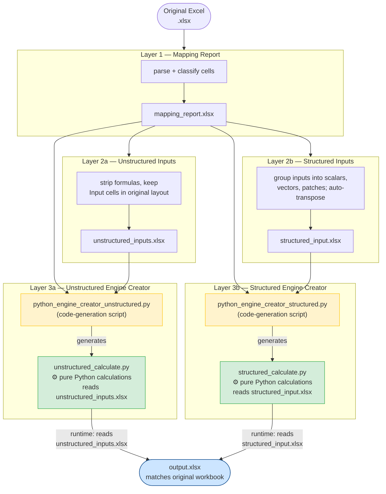

# LLM Instructions: Excel-to-Python Conversion Pipeline

## Role & Goal

You are implementing a system that converts an Excel financial model into a reproducible, editable Python pipeline. The pipeline extracts the model's inputs and calculations, stores them in clean intermediate files, and regenerates the output programmatically — without ever opening Excel.

> **Golden Rule:** `mapping_report.xlsx` is the single source of truth and the contract between the parser and every downstream stage. Never bypass it. All decisions about what to include, group, or regenerate are encoded in that file.

---

## Pipeline Overview

```
Original Excel (.xlsx)
        │
        ▼
┌─────────────────────────────┐
│  Layer 1 — Mapping Report   │  mapping_report.xlsx
└─────────────────────────────┘
        │
        ├──────────────────────────────────────┐
        ▼                                      ▼
┌──────────────────────┐          ┌────────────────────────┐
│  Layer 2a            │          │  Layer 2b              │
│  Unstructured Inputs │          │  Structured Inputs     │
│  unstructured_       │          │  structured_input.xlsx │
│  inputs.xlsx         │          │                        │
└──────────────────────┘          └────────────────────────┘
        │                                      │
        ▼                                      ▼
┌──────────────────────┐          ┌────────────────────────┐
│  Layer 3a — Engine   │          │  Layer 3b — Engine     │
│  python_engine_      │          │  python_engine_        │
│  creator_            │          │  creator_              │
│  unstructured.py     │          │  structured.py         │
└──────────────────────┘          └────────────────────────┘
        │  (generates)                  │  (generates)
        ▼                               ▼
┌──────────────────────┐          ┌────────────────────────┐
│  unstructured_       │          │  structured_           │
│  calculate.py        │          │  calculate.py          │
│  (pure Python calcs) │          │  (pure Python calcs)   │
└──────────────────────┘          └────────────────────────┘
        │  reads                        │  reads
        │  unstructured_inputs.xlsx     │  structured_input.xlsx
        │                               │
        └──────────────┬────────────────┘
                       ▼
                  output.xlsx
          (matches original workbook)
```

Both paths must produce an identical `output.xlsx` that matches the original workbook in formulas, formatting, and values.

> **Critical Constraint — Python is the only execution engine.** At no point do any calculations happen inside Excel or by evaluating Excel formulas. The generated `calculate.py` files contain real, executable Python arithmetic and logic that replicates every formula from the original workbook. The input template files (`unstructured_inputs.xlsx` / `structured_input.xlsx`) hold only raw input values — they are data stores, not calculators.

---

## Layer 1 — Intermediate Mapping Report

**Output:** `mapping_report.xlsx`

Parse the original Excel workbook and produce a comprehensive intermediate file that captures everything needed to reconstruct it.

### Cell Classification

Classify every cell into exactly one of three types:

| Type | Definition |
|------|-----------|
| `Input` | Plain hardcoded value — no formula |
| `Calculation` | Formula cell that is referenced by at least one other formula |
| `Output` | Formula cell that is **not** referenced by any other formula (terminal node) |

### What to Record

- For dragged/repeated formulas, detect the pattern and group them. Record: `GroupID`, `GroupDirection`, `GroupSize`, `PatternFormula`.
- Per-cell metadata: `Sheet`, `Cell`, `Type`, `Formula`, `Value`, number format, font (bold / italic / size / color), fill color, alignment, `WrapText`, `IncludeFlag`.
- **Important:** Detect and record when a formula has been dragged across multiple cells (rows or columns).Document it in the mapping_report.xlsx. This is crucial for vectorization.

### Output Structure

- One sheet per source sheet, plus a `_Metadata` sheet.
- A human reviewer may open it, flip `IncludeFlag` to `False`, or add rows before feeding it to any downstream stage.
- **This file must contain everything needed to reconstruct the original workbook and drive code generation.**

---

## Layer 2a — Unstructured Input File

**Output:** `unstructured_inputs.xlsx`

Produce the simplest possible editable input file — the same layout as the original workbook but with all formulas stripped out.

- Read `mapping_report.xlsx`.
- Extract all cells where `Type == "Input"` and `IncludeFlag == True`.
- **Delete all formula cells entirely.** Retain only raw hardcoded values in their original sheet positions and formatting.
- The user edits this file with new data. Downstream, `unstructured_calculate.py` reads it and reproduces the full output using the calculations stored in `mapping_report.xlsx`.

---

## Layer 2b — Structured Input File

**Output:** `structured_input.xlsx`

Produce a clean, tabular input file organised by source sheet — suitable for bulk data entry and downstream code generation.

- Read `mapping_report.xlsx` only (avoid reading additional files unless strictly necessary).
- Extract all cells where `Type == "Input"` and `IncludeFlag == True`.

### Scalars

- Isolated cells or length-1 runs are **scalars**.
- All scalars go to the **Config sheet**, with their source sheet reference recorded.

### Vectors & Patches

- Identify contiguous rectangular patches of `Input` cells. Each patch becomes a table.
- A single source sheet may produce **multiple input tables** when it contains patches with different header types (e.g. one patch with financial-date headers, another with non-date headers).

### Auto-Transpose Rule

- If a patch's column headers are financial dates/periods — integers like `2020`, strings like `"2020E"`, or datetime objects — **transpose** the table: rows = periods, columns = metrics.
- Otherwise keep the original orientation: rows = metrics, columns = periods/headers.
- If a row/column label cannot be resolved from the source sheet, assign `Line1`, `Line2`, … as the label.

### Output Structure

| Sheet | Contents |
|-------|---------|
| **Index** | Cross-reference between this file and `mapping_report.xlsx`; useful for both human review and downstream code generation |
| **Config** | All scalars and short (label + 1 data value) vectors |
| **Per-source-sheet tabs** | One or more tabular input tabs per source sheet that contains ≥ 1 vector input |

---

## Layer 3a — Unstructured Engine Creator

**Output (stage deliverable):** `python_engine_creator_unstructured.py`
**Generated artifact:** `unstructured_calculate.py`

### What Layer 3a must build

Layer 3a produces `python_engine_creator_unstructured.py` — a code-generation script that reads `mapping_report.xlsx` and writes a new Python file called `unstructured_calculate.py` specifically tailored to the workbook being converted.

```
mapping_report.xlsx  ──▶  python_engine_creator_unstructured.py  ──▶  unstructured_calculate.py
```

### What `unstructured_calculate.py` must contain

`unstructured_calculate.py` is the runtime calculation engine for the unstructured path. It must:

1. **Read inputs from `unstructured_inputs.xlsx`** — load every cell value from its exact original sheet position and cell address.
2. **Re-implement every formula as native Python code.** Each formula from `mapping_report.xlsx` must become a Python expression or statement. No formula string is ever passed back to Excel for evaluation — Python is the sole execution engine.
3. **Respect dependency order.** Calculations must be emitted in topological order so that every cell is computed after all cells it depends on.
4. **Apply vectorization wherever possible.** Dragged formula groups (`GroupID` / `GroupSize`) must be expressed as vectorised operations (e.g. NumPy array ops or list comprehensions), not cell-by-cell loops.
5. **Write `output.xlsx`** — reconstruct the full workbook with all original formatting, number formats, fonts, fills, and alignment sourced from `mapping_report.xlsx`. Cell values come from Python computation results, not from Excel.

> **Absolute rule:** `unstructured_calculate.py` must not trigger any Excel calculation or open any Excel application. It is a standalone Python script. Every numeric result is produced by Python arithmetic.

- **Test against every Excel file in the `ExcelFiles/` folder.** Write helper functions to compare `output.xlsx` values cell-by-cell against the original. Resolve every mismatch before proceeding.

---

## Layer 3b — Structured Engine Creator

**Output (stage deliverable):** `python_engine_creator_structured.py`
**Generated artifact:** `structured_calculate.py`

### What Layer 3b must build

Layer 3b produces `python_engine_creator_structured.py` — a code-generation script that reads `mapping_report.xlsx` alongside `structured_input.xlsx` (to understand the layout of the structured input) and writes a new Python file called `structured_calculate.py` specifically tailored to the workbook being converted.

```
mapping_report.xlsx  ─┐
                       ├▶  python_engine_creator_structured.py  ──▶  structured_calculate.py
structured_input.xlsx ─┘
```

### What `structured_calculate.py` must contain

`structured_calculate.py` is the runtime calculation engine for the structured path. It must:

1. **Read inputs from `structured_input.xlsx`** — parse the Config sheet for scalars and each per-source-sheet tab for vector/table inputs. Map every value back to its original cell address using the Index sheet.
2. **Re-implement every formula as native Python code.** Each formula from `mapping_report.xlsx` must become a Python expression or statement. No formula string is ever passed back to Excel — Python is the sole execution engine.
3. **Respect dependency order.** Calculations must be emitted in topological order so that every cell is computed after all cells it depends on.
4. **Apply vectorization wherever possible.** Dragged formula groups must be expressed as vectorised operations (e.g. pandas / NumPy), not cell-by-cell loops.
5. **Write `output.xlsx`** — reconstruct the full workbook with all original formatting, number formats, fonts, fills, and alignment sourced from `mapping_report.xlsx`. Cell values come from Python computation results, not from Excel.

> **Absolute rule:** `structured_calculate.py` must not trigger any Excel calculation or open any Excel application. It is a standalone Python script. Every numeric result is produced by Python arithmetic.

- **Test against every Excel file in the `ExcelFiles/` folder.** Write helper functions to compare `output.xlsx` values cell-by-cell against the original. Resolve every mismatch before proceeding.

---

## Process Guidelines

### Planning
- Plan deeply before writing any code. Anticipate edge cases and failure modes.
- Re-plan after reviewing intermediate results. Never proceed to the next stage with unresolved mismatches.

### Verification at Every Stage
- After generating each intermediate file (`mapping_report.xlsx`, `unstructured_inputs.xlsx`, `structured_input.xlsx`), **open and inspect it**. Verify its content against the original workbook.
- These files are read by humans and by downstream code — they must be correct, complete, and clearly structured.
- For the final `output.xlsx`, compare every cell value against the original. Log and fix all discrepancies.

### Testing
- The `ExcelFiles/` folder contains multiple example workbooks. **This pipeline must work over the full variety of files provided.** Test each file individually.
- Write reusable comparison utilities. Do not eyeball results.
- Testing happens at every stage in 2 levels:
        1. **Intermediate file verification** — open and inspect each generated file to confirm it matches expectations.
        2. **Final output verification** — compare `output.xlsx` against the original workbook cell-by-cell, logging all mismatches for resolution. Then, if it does not match, Identify which stage(s) introduced the mismatch by comparing intermediate files against the original workbook. Then, finetune the code to produce the correct intermediate files, which will in turn produce the correct final output.

### Code Quality
- Write modular, well-documented code.
- Produce a `DOCUMENTATION.md` covering:
  - Overall architecture
  - Purpose of each module
  - How modules interact
  - Instructions for running, testing, and troubleshooting

### Secondary Deliverables
- `DOCUMENTATION.md` — detailed architecture and usage guide (described above)
- Test scripts — comprehensive tests for each pipeline stage
- Mermaid diagrams — illustrating the pipeline flow and the structure of each intermediate file
- Write a document which shows me the exact commands on runningeach section: Only 1, 1 -> 2a, 1 -> 2b, 1->2a->3a, 1->2b->3b. Give me the exact commands for this


### Other Notes
- Use Vectorization at every stage possible - avoid cell-by-cell processing when generating intermediate files or final output. This is to ensure the pipeline can scale to large workbooks and that the python code is readable and maintainable. **This is a must**
- When testing, if polling takes too long, try to understand why and mayne consider checking progress.
- **Never let any calculation happen inside Excel.** If you find yourself writing a formula into a cell in any output file and relying on Excel to evaluate it, that is a bug. All arithmetic must happen in Python.

---

## Pipeline Flow Diagram



> **Key:** Yellow boxes = code-generation scripts (run once per workbook to produce the calculate file). Green boxes = generated calculation engines (run at runtime with user-edited inputs). The calculate files contain **only Python** — no Excel formulas, no Excel COM, no openpyxl formula evaluation.