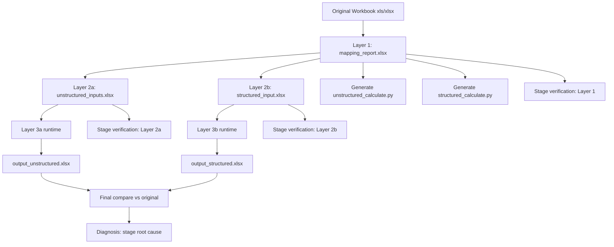
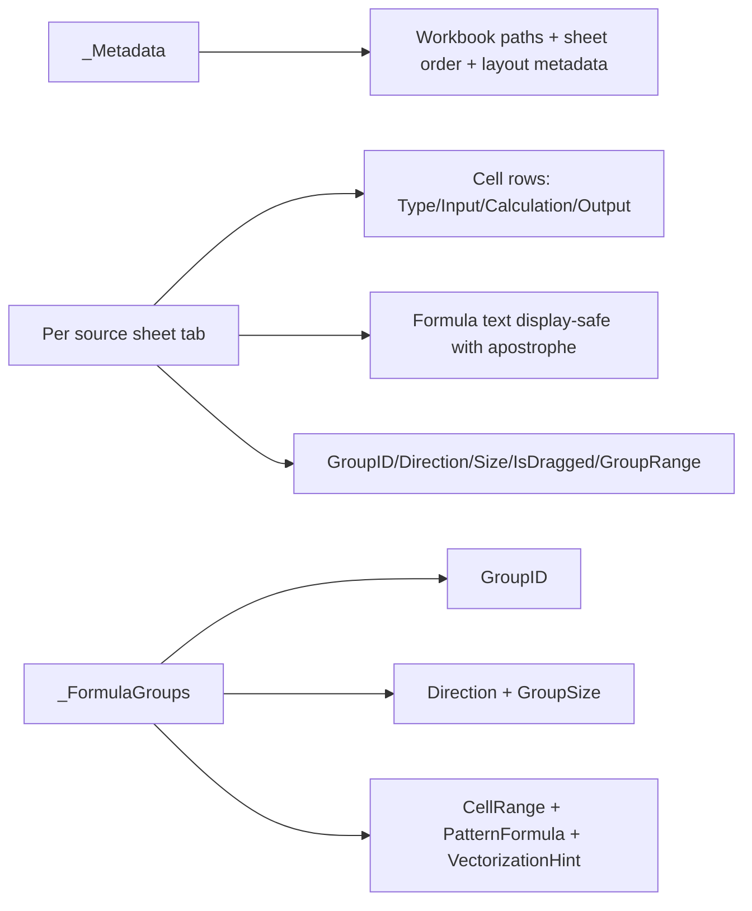

# Excel-to-Python Conversion Pipeline

## Architecture Overview
This implementation converts each workbook in `ExcelFiles/` through 3 layers, with `mapping_report.xlsx` as the contract.

- **Layer 1**: `mapping_report.xlsx` (cell classification + metadata + formula grouping)
- **Layer 2a**: `unstructured_inputs.xlsx`
- **Layer 2b**: `structured_input.xlsx`
- **Layer 3a/3b**: generated `unstructured_calculate.py` and `structured_calculate.py`
- **Verification**: stage checks + final workbook cell-by-cell comparison

The pipeline is implemented in `excel_pipeline/` and orchestrated by `run_pipeline.py`.

## Cross-Platform Support
- `.xlsx`: read directly with `openpyxl`
- `.xls` on **Windows**: uses Microsoft Excel COM automation (`pywin32`) when available
- `.xls` fallback: uses `soffice --headless` conversion

## Vectorization Strategy
Vectorization is applied wherever workbook APIs allow it:

- **Dragged formula grouping**: pandas vectorized run segmentation (`groupby`, `diff`, `cumsum`)
- **Mapping write path**: per-sheet DataFrame materialization + bulk row emission
- **Sparse traversal**: avoids full-grid scans; operates on populated-cell collections
- **Structured input assembly**: patch-level batch processing and index mapping

`openpyxl` workbook writes are still cell-address based by design, but expensive analysis paths were moved to vectorized/tabular operations.

## Module Map
- `excel_pipeline/normalize.py`: workbook normalization (`.xls` -> `.xlsx`)
- `excel_pipeline/mapping.py`: Layer 1 extraction + formula grouping + mapping report writer
- `excel_pipeline/mapping_io.py`: mapping report reader
- `excel_pipeline/layer2_unstructured.py`: Layer 2a generator
- `excel_pipeline/layer2_structured.py`: Layer 2b generator
- `excel_pipeline/reconstruct.py`: workbook reconstruction from mapping + inputs
- `excel_pipeline/runtime.py`: runtime calculators for unstructured/structured paths
- `excel_pipeline/codegen.py`: generated calculator emitters
- `excel_pipeline/compare.py`: final output comparison
- `excel_pipeline/verify.py`: stage-level verification + root-cause diagnosis
- `excel_pipeline/runner.py`: end-to-end orchestration (single file or directory)

## Mermaid: End-to-End Flow


## Mermaid: `mapping_report.xlsx` Structure


## Stage Verification (2 Levels)
For each workbook:

1. **Intermediate file verification**
- Layer 1: mapping vs original workbook consistency
- Layer 2a: unstructured file has only included inputs; formulas removed
- Layer 2b: structured index mappings are complete and value-consistent

2. **Final output verification**
- Compare generated output workbook against original workbook cell-by-cell
- If mismatch occurs, diagnosis maps failure to Layer 1 / Layer 2 / Layer 3

Reports are written to each workbook artifact folder as `validation_report.json`.

## How To Run
### Single workbook
```bash
.venv/bin/python run_pipeline.py \
  --single-file ExcelFiles/ACC-Ltd.xlsx \
  --output-root artifacts_single \
  --cache-dir .cache/normalized
```

### Full folder (parallel)
```bash
.venv/bin/python run_pipeline.py \
  --excel-dir ExcelFiles \
  --output-root artifacts \
  --cache-dir .cache/normalized \
  --workers 4
```

## Testing
- Smoke test: `tests/test_pipeline.py`
- Full validation script: `tests/run_full_validation.py`
- Main validation artifact: `artifacts/summary.json`

## Troubleshooting
- **`.xls` conversion fails**:
  - On Windows: install `pywin32` and ensure Excel is installed
  - Else: install LibreOffice and ensure `soffice` is on PATH
- **Large workbook performance**:
  - Increase `--workers`
  - Keep `--cache-dir` persistent to reuse converted `.xlsx`
- **Unexpected mismatch**:
  - Open `artifacts/<WorkbookName>/validation_report.json`
  - Inspect `intermediate_checks.stage_verification` and `diagnosis`
