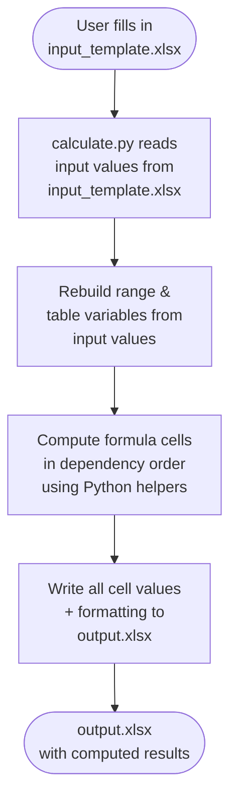

# Excel-to-Python: Algorithm Overview

This document describes the high-level flow of the Excel-to-Python converter.

## How It Works

```mermaid
flowchart TD
    A([User provides\ninput.xlsx]) --> B[Load config.yaml\noptional settings]
    B --> C[Load workbook\nwith openpyxl]
    C --> D[Parse Workbook\nextract sheets, cells,\nformatting & tables]

    D --> E{Classify each cell}
    E -->|value starts with '='| F[Formula Cells\ne.g. =SUM&#40;A1:A5&#41;]
    E -->|plain value| G[Hardcoded Cells\ne.g. 42, 'Sales']

    F --> H[Find all references\nused across formulas\ncells, ranges, tables]
    H --> I{config: delete\nunreferenced?}
    G --> I
    I -->|yes| J[Keep only hardcoded cells\nthat are referenced\nby a formula]
    I -->|no| K[Keep all\nhardcoded cells]

    J --> L[Build dependency order\ntopological sort so each\nformula is computed after\nits dependencies]
    K --> L

    L --> M[Convert Excel formulas\nto Python expressions\nvia FormulaConverter]

    M --> N[Generate calculate.py\nPython script with\nall formulas in order]
    L --> O[Generate input_template.xlsx\nwith hardcoded values\nfor the user to fill in]

    N --> P([Output: calculate.py\n+ input_template.xlsx])
    O --> P
```

## Generated Script: Runtime Flow

Once `excel_to_python.py` has produced `calculate.py` and `input_template.xlsx`, the user
fills in any input values and then runs the generated script:

## Key Steps at a Glance

| Step | What happens |
|------|-------------|
| **Parse** | `openpyxl` opens the workbook; every cell's value, formula, format, font, fill and alignment is read. Named tables and their column headers are also collected. |
| **Classify** | Cells whose value starts with `=` are **formula cells**; all others are **hardcoded input cells**. |
| **Reference scan** | Each formula is parsed to record every cell, range and table it references, so the tool knows which inputs feed which outputs. |
| **Filter** | If `delete_unreferenced_hardcoded_values: true` is set in `config.yaml`, hardcoded cells that no formula ever uses are dropped from the input template. |
| **Dependency sort** | A topological sort (Kahn's algorithm) orders formula cells so that every formula is evaluated only after the cells it depends on are already computed. |
| **Formula conversion** | `FormulaConverter` rewrites each Excel formula into a Python expression, mapping Excel functions (SUM, IF, VLOOKUP, …) to equivalent Python helper functions. |
| **Code generation** | `calculate.py` is written with: input-reading code, range/table builder helpers, formula computations in dependency order, and output-writing code that preserves formatting. |
| **Template generation** | `input_template.xlsx` is created as a pre-filled Excel file so the user can simply edit the relevant cells and re-run the calculation. |
