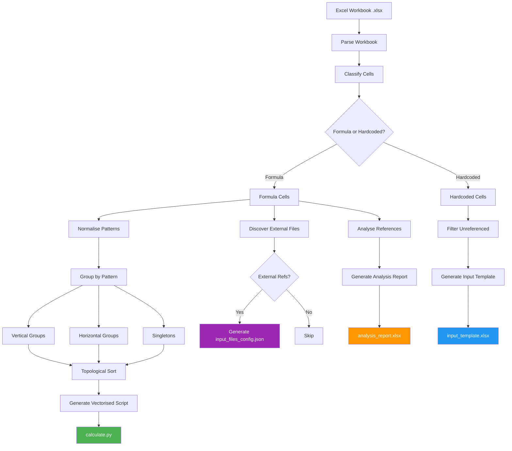
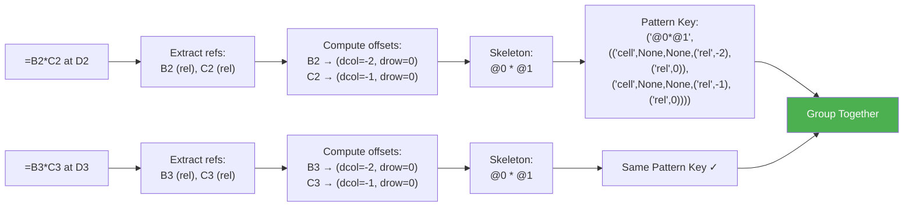
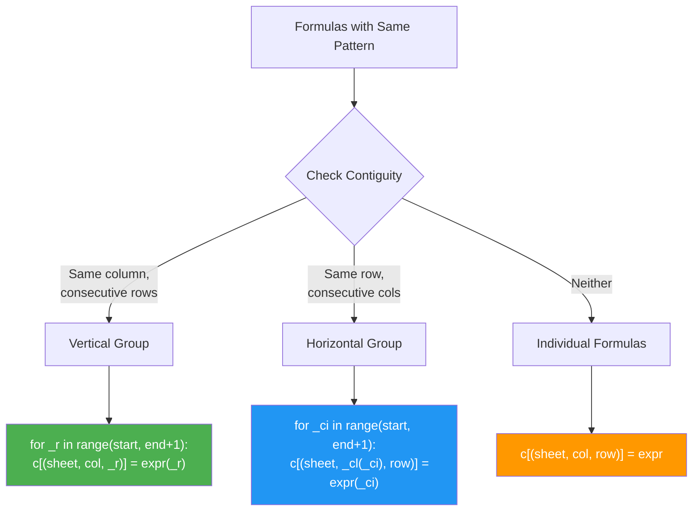
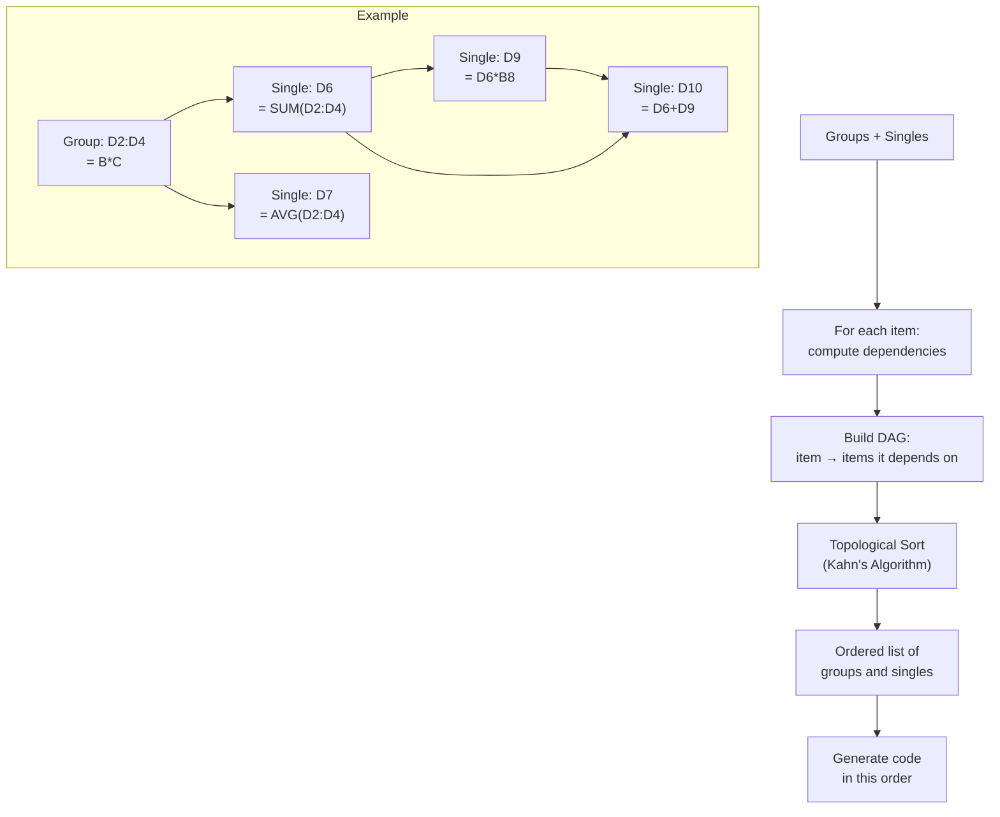
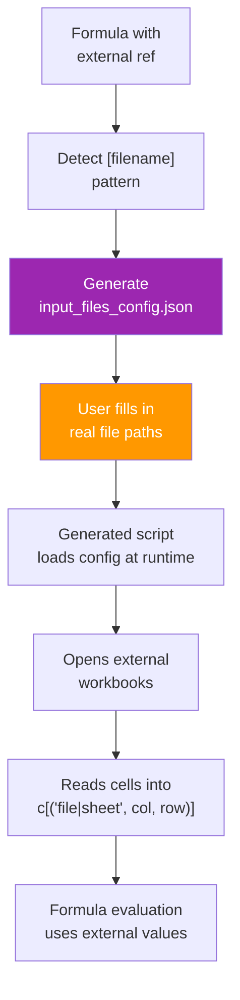
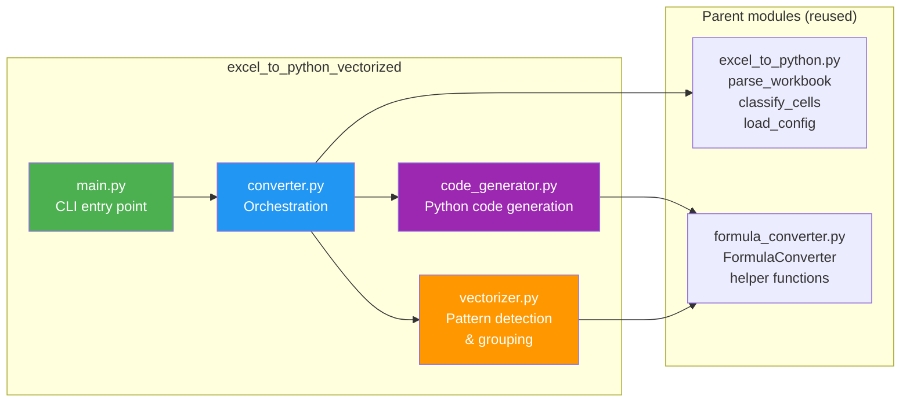
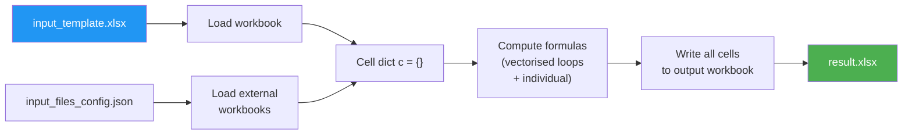

# Architecture & Algorithm Diagrams

## End-to-End Pipeline

## Pattern Normalisation

## Grouping & Code Generation

## Dependency Resolution

## External File Reference Flow

## Module Structure

## Generated Script Data Flow

